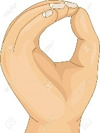

# FACT (Fight against corona threat)

Corona spreads only when personal hygiene is low. Let us **fight against corona threat** by conscious personal hygiene.

We all make a few unconscious hand movements and it is equally simple to be conscious about these movements. Now, let us **fight against corona threat** together.

Pledge to follow these simple ways to prevent corona virus

1. Sneeze into your elbow so that hands are not contaminated
2. Do not touch contaminated surfaces
3. Wash your hands
4. Gargle with salt water
5. Ensure hygiene before touching the yours or your loved one&#39;s face
6. Communicate personal hygiene threats around you by gently raising your hand and showing a zero. A gentle way of reminding others about washing hands. 

The strategy is to create a mobile app to keep us focused on this **FACT** (**fight against corona threat)**

1. that would remind us about personal hygiene
2. that would detect and make us conscious about our unconscious hand movements. Alert on fast hand movements (vibrate and small sound)
3. Practice personal hygiene the fun way

# How you can contribute
Everybody has a strong role to play in this **FACT** (**fight against corona threat)**

1. Community volunteers can practice prevention methods and create awareness on social media
2. Language experts translate and spread the message
3. Microbiology subject matter experts can contribute by sharing key information (Corona physical attributes (size/shape/color etc), its detection (optical, acoustic, thermal, radio wave sensitivity etc) and control (reaction to light, sound, radio waves, heat etc)
4. Medical practitioners can contribute tips
5. Psychologists can contribute tips to improve consciousness
6. App developers can contribute to the project
  1. UI developers for different smartphone platforms (Android, Apple)
  2. Integration of wearables (Smart watch etc)
7. App QA engineers can contribute by Testing out the features as they are developed using their equipment
8. More to come

